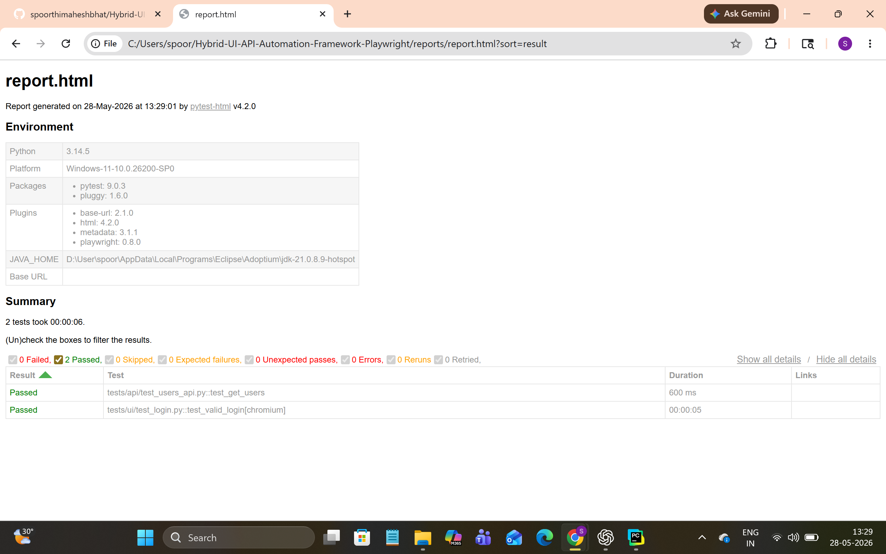

# Hybrid UI & API Automation Framework

## Overview
A scalable hybrid automation framework built using Python, Playwright, Pytest, and Requests for UI and API testing.

## Tech Stack
- Python
- Playwright
- Pytest
- Requests
- Pytest HTML Reports

## Framework Features
- UI Automation
- API Automation
- Page Object Model (POM)
- Reusable API Client
- HTML Reporting
- Pytest Fixtures

## Project Structure

# Project Structure

```text
Hybrid-UI-API-Automation-Framework-Playwright/
│
├── api_helpers/
│   ├── __init__.py
│   ├── api_client.py
│   └── endpoints.py
│
├── pages/
│   ├── __init__.py
│   └── login_page.py
│
├── tests/
│   ├── __init__.py
│   │
│   ├── api/
│   │   ├── __init__.py
│   │   └── test_users_api.py
│   │
│   └── ui/
│       ├── __init__.py
│       └── test_login.py
│
├── reports/
│   └── report.html
│
├── .gitignore
├── conftest.py
├── README.md
├── requirements.txt
```

## How to Run Tests

```bash
pytest
```

## Generate HTML Reports

```bash
pytest --html=reports/report.html
```
Screenshots:
